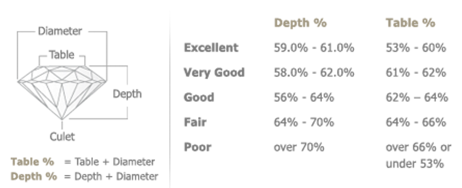

# Dataset Attributes (data dictionary)

The dataset contains 53943 records each cotaining prices and other corresponding attributes of diamond cuts.

The cuts are defines in the following feautres (there are 10 features in total which 7 are numeric and 3 categoric). Four of the feautures refer as kown as the 4 Cs of Diamonds (carat, cut, color, clarity).

| #   | Feaute | Type | Description |
| --- | --- | --- | --- |
| 1   | **carat** | ``` float ``` | The weight of the stone. 1 carat refers to 0.200 grams, or 1/5th of a gram. In the dataset, it ranges between (0.2 - 5.01) carats. 5 carats equals to 1 gram. |
| 2   | **cut** | ``` categorical ``` | Quality of the cut (Fair, Good, Very Good, Premium, Ideal) - *Ideal* refers to the best cut, while *Fair* the worst. |
| 3   | **color** | ``` categorical ``` | Diamond color (J - worst to D - best). Colorless diamonds are considered better than diamonds with a yellow tint. diamonds contains diamonds of 7 different colors, represented by different letters. “D” - “F” diamonds are considered colorless, while “G” - “J” diamonds have a very faint color. |
| 4   | **clarity** | ``` categorical ``` | refers to how clear a diamond is. Diamonds often contain imperfections like cracks or mineral deposits. The fewer and less noticeable a diamond’s imperfections, the better its clarity. clarity contains 8 ordered levels, from “I1” (the worst) to “IF” (the best). [see detailed table](#ClarityCategories) |
| 5   | **X, Y, Z** | ``` float ``` | Diamond dimensions (length, width, depth respectively) in millimeters.<br/>X  (0 - 10.74) mm<br/>Y (0 - 58.9) mm<br/>Z (0 - 31.8) mm |
| 6   | **depth** | ``` float ``` | Total depth percentage calculated through $(z / mean(x, y)) = (2 * z / (x + y))$ The "ideal" depth percentage varies depending on the diamond's shape, but generally ranges from 58% to 62% for round diamonds and can be slightly higher or lower for other shapes. In the dataset, it represents percetages between (43% - 79%). |
| 7   | **table** | ``` float ``` | Width of top of diamond relative to widest point. A diamond's table percentage, which is the ratio of the table's width to the diamond's overall width, is a key factor in evaluating the diamond's quality. The ideal table percentage varies depending on the diamond's shape, but for round brilliant cuts, it's generally considered to be between 53-58%. The main purpose of a diamond table is to refract entering light rays and allow reflected light rays from within the diamond to meet the observer’s eye. The ideal table cut diamond will give the diamond stunning fire and brilliance. It ranges between 43 - 95 in the dataset. |
| 8   | **price** | ``` float ``` | Price in US Dollar between (\$326 - \$18,823) |

### Definition of Diamond measurements

The image below shows all main measurements that affect a diamond's cut grade, according to the **GIA (Gemological Institute of America)**.

The scale shown in the image refer to ratings based on how well the diamond's proportions maximize brilliance, fire, and scintillation. The measuemenets have high impact on **_GIA Cut Scale_**

#### Diamond Anatomy & Measurements:

* **Girdle Diameter**: Width across the widest part of the diamond.
* **Table Size**: Width of the flat top facet.
* **Depth**: Vertical measurement from table to culet.
* **Crown Height**: Height of the crown above the girdle.
* **Pavilion Depth**: Depth below the girdle to the culet.
* **Crown Angle**: Angle between the girdle and the crown facets.
* **Pavilion Angle**: Angle between the girdle and pavilion facets.
* **Star Facet**: Small triangular facets surrounding the table.
* **Lower Half Facet**: Elongated facets below the girdle on the pavilion.
* **Girdle Thickness**: Thickness of the diamond's widest part.
* **Culet Size**: Small facet at the bottom point of the pavilion.

* * *

<p align="center">
  
</p>

* * *

### Diamond Cut Quality Reference Chart

#### Diagram Description:

A labeled diagram of a diamond shows the following components:

* **Diameter** – the width of the diamond.
* **Table** – the flat top facet of the diamond.
* **Depth** – the height from the table to the culet (bottom tip).
* **Culet** – the very bottom tip of the diamond.

**Formulas:**

* **Table % = (Table / Diameter)**
* **Depth % = (Depth / Diameter)**

* * *

This chart helps jewelers and buyers assess whether a diamond has ideal proportions for maximizing brilliance and value.


<p align="center">
  
</p>

* * *

### Diamond Depth Evaluation Guide

This visual guide illustrates how a diamond's **depth percentage** impacts its appearance and light performance.

#### Measurement Reference:

* **Depth**: The vertical height of the diamond from the table (top) to the culet (bottom).
* **Diameter**: The width of the diamond at its widest point.

As seen above, the **Table** and **Depth** variables help determining the best cut. The Examples bellow illustrate the categorization shown above in terms of its **Table** and **Depth** percentages.

#### Too Shallow

* **Depth %: 53% and below**
* The diamond appears flat.
* May leak light, resulting in poor brilliance and sparkle

#### Ideal

* **Depth %: 54% to 66%**
* Considered optimal for maximizing **sparkle and light performance**.
* Reflects light effectively for maximum brilliance.

#### Too Deep

* **Depth %: 67% and above**
* The diamond appears tall or bulky.
* Can trap light, reducing sparkle and making the stone appear smaller than it is.

* * *

Use this guide to help determine the ideal depth proportions for a well-cut diamond.

<p align="center">
  
</p>

* * *

### Clarity Categories

| Clarity Level | Descrption |
| --- | --- |
| **IF** | Internally Flawless: Diamond free from inclusions and defects, but may have small surface blemishes. |
| **VVS1** | Very, very slightly included 1: Small inclusions visible only at 20x magnification or higher. |
| **VVS2** | Very, very slightly included 2: Inclusions more numerous or slightly larger in size than in VVS1, but still only visible at 20x magnification or higher |
| **VS1** | Very slightly included 1: Inclusions visible at 10x magnification, but not to the naked eye |
| **VS2** | Very slightly included 2: Inclusions more numerous or slightly larger in size than in VS1, visible at 10x magnification and, in some cases, to the naked eye in larger diamonds |
| **SI1** | Slightly included 1: Inclusions visible to the naked eye, but may be small and not very noticeable |
| **SI2** | Slightly included 2: Inclusions that are more visible to the naked eye and may be more prominent and/or in greater quantity than in SI1 |
| **I1** | Included 1: Inclusions that are visible to the naked eye and may be quite significant, impacting the appearance of the diamond |
